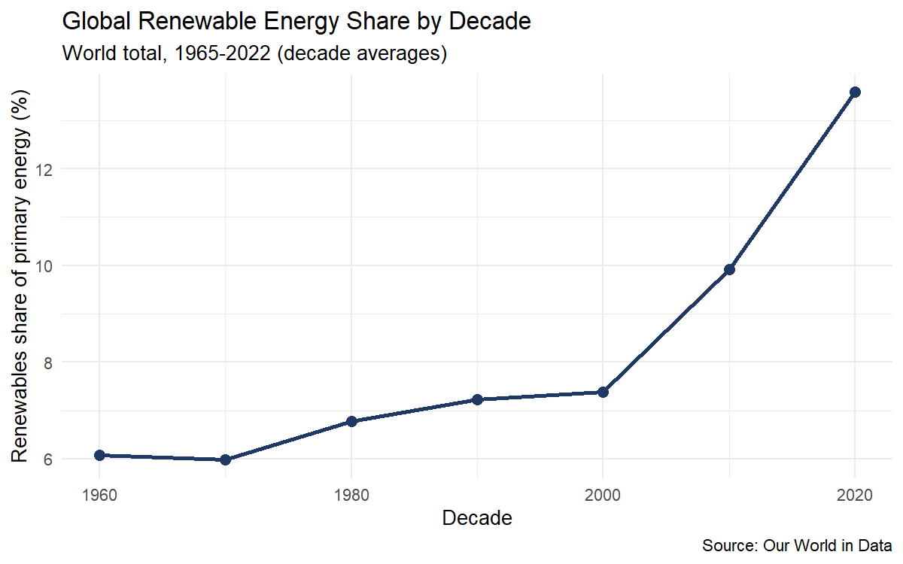
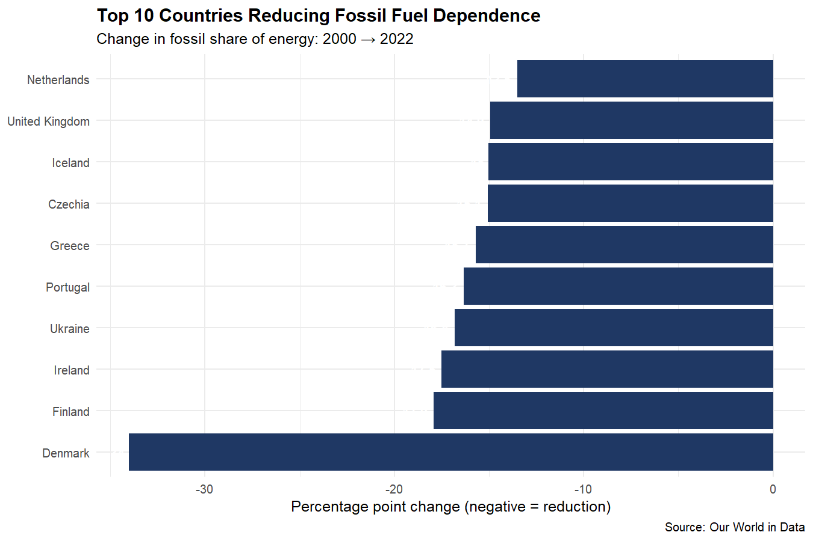
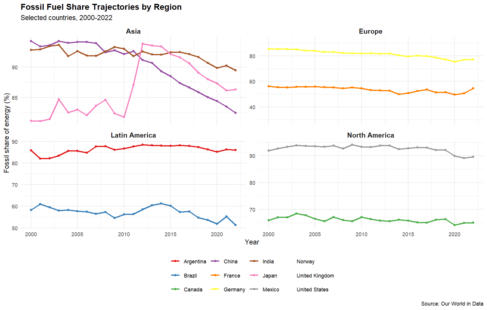

# Energy Project Analytics

End-to-end data analytics pipeline on global energy data — from SQL extraction through statistical modeling to interactive visualization. Built to practice the full stack of tools used in entry-level data science roles: **SQL, Python, R, Plotly, and ggplot.**

---

## Key Findings

### 1. Global renewable energy share is accelerating after 50 years of stagnation

Renewable share of primary energy hovered around 6-7% from 1965 through the late 1990s, then began climbing — reaching 13.6% by 2022. The transition is real but it started recently, post-2010.

### 2. The energy transition is driven by policy, not just wealth

GDP per capita correlates only **0.15** with renewable share — much weaker than expected. The strongest fossil-fuel reductions all come from European countries with aggressive policy environments (EU targets, carbon pricing), not from the wealthiest economies overall.

Denmark leads with a 34 percentage-point reduction in fossil share from 2000 to 2022, driven by its wind energy buildout. The UK's 14.9pp reduction reflects its coal phase-out program.

### 3. Regional trajectories diverge sharply

European nations are decarbonizing faster than any other region. North America and Latin America show modest reductions. Asia is mixed — China is reducing, India is roughly flat, and Japan has actually *increased* its fossil share since the 2011 Fukushima nuclear shutdown.

---

## Tech Stack

| Layer | Tool | Purpose |
|---|---|---|
| Data extraction | SQL (SQLite) | Querying and aggregating raw data |
| Data transformation | Python (Pandas) | Cleaning, joins, derived columns |
| Statistical analysis | Python (statsmodels, scikit-learn) | OLS regression, predictive modeling |
| R analysis | R (dplyr, ggplot2, tidyr) | Tidy data manipulation, statistical graphics |
| Visualization | Plotly + ggplot2 + Seaborn | Inline + saved chart outputs |
| Version control | Git + GitHub | Reproducibility and code history |

---

## Repository Structure

\\\
energy-project-analytics/
├── data/             # Raw CSV + cleaned outputs (energy.db is gitignored)
├── sql/              # SQL queries against the SQLite database
├── notebooks/        # Jupyter notebooks for Python analysis + EDA
├── r_scripts/        # R scripts using dplyr and ggplot2 (+ saved PNGs)
├── dashboard/        # Plotly dashboard (in progress)
├── shiny_app/        # R Shiny app (in progress)
└── README.md
\\\

---

## Methodology

**Data extraction (SQL).** Loaded the OWID energy dataset (1965-2022, 23k+ rows) into SQLite. Wrote 8+ analytical queries covering filtering, aggregation, GROUP BY/HAVING, self-joins for year-over-year comparisons, and string-pattern filters to exclude regional aggregates from country-level analysis.

**Statistical analysis (Python).** Loaded SQL results into Pandas, generated EDA (summary statistics, correlation matrix), then fit a linear regression predicting renewable share from log GDP per capita and year. Both predictors were statistically significant (p < 0.001), but R² of 0.022 confirmed that wealth and time alone don't explain renewable adoption — country-specific factors (geography, policy, resources) drive most variation.

**Tidy data analysis (R).** Replicated the SQL decade-trend analysis in dplyr to validate cross-language consistency. Built a regional trajectory analysis using \pivot_wider()\, \inner_join()\, and faceted ggplot for cross-country comparison.

---

## Setup

\\\powershell
# 1. Clone the repo
git clone https://github.com/ravinder-bindra/energy-project-analytics.git
cd energy-project-analytics

# 2. Download the dataset
cd data
Invoke-WebRequest -Uri "https://raw.githubusercontent.com/owid/energy-data/master/owid-energy-data.csv" -OutFile "energy_data.csv"

# 3. Build the SQLite database
pip install sqlite-utils
sqlite-utils insert energy.db energy energy_data.csv --csv

# 4. Install Python dependencies
pip install jupyter pandas numpy scikit-learn statsmodels matplotlib seaborn

# 5. Install R dependencies (in RStudio Console)
# install.packages(c("dplyr", "ggplot2", "readr", "tidyr", "scales"))
\\\

---

## Progress

- [x] SQL exploration and analytical queries
- [x] Python data cleaning, EDA, and OLS regression
- [x] R analysis with dplyr and ggplot2 (decade trend + regional fossil analysis)
- [ ] Plotly interactive dashboard
- [ ] R Shiny reactive app

---

## Author

**Ravinder Deep Singh Bindra**
B.Tech Data Science, Punjab Engineering College, Chandigarh
[ravinderbindra26@gmail.com](mailto:ravinderbindra26@gmail.com)
